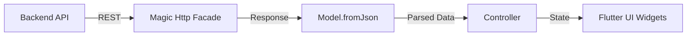

# Uptizm Project Context

> Project-level AI agent rule for the Uptizm Flutter application.

## Project Overview

**Uptizm** (Uptime + Izm) is a next-generation uptime monitoring SaaS platform for developers and companies. Unlike standard HTTP status code monitors, Uptizm parses JSON/HTML responses, reads specific data (DB connections, Redis usage, etc.), and executes "Assertion Rules" for deep health monitoring.

### Brand Identity
- **Name**: Uptizm
- **Primary Color**: Shamrock Green (`primary` in WindTheme)
- **Design Language**: Tailwind CSS-inspired, modern, clean, modular UI

---

## Target Audience

| Segment | Use Case |
|---------|----------|
| **Developers & DevOps** | Monitor API endpoint health status in depth |
| **SaaS Companies** | Transparently display service status to customers |
| **Agencies** | Manage multiple client projects from a single dashboard |

---

## Architecture

### Frontend (This Project)
- **Framework**: Flutter (Dart)
- **Packages**: `fluttersdk_magic` (Magic)
- **UI**: Hybrid UI Strategy (Native Layouts + Wind Components)
- **Target Platforms**: iOS, Android, Web (single codebase)

### Backend (Separate Project)
- **Framework**: Laravel 12.x (PHP 8.4+)
- **API**: RESTful
- **Auth**: Laravel Sanctum
- **Queue**: Laravel Horizon (Redis)
- **Database**: PostgreSQL 17 + TimescaleDB

> [!NOTE]
> This rule file covers the **Flutter frontend** only. Backend details are for context.

---

## Responsive Architecture

This project uses a **single codebase** with Flutter's `LayoutBuilder` and `MediaQuery` for adaptive layouts.

### Desktop/Web (md and above)
- Fixed **Sidebar** navigation on the left
- **Organization selector** at the top of sidebar
- Wide tables and grid-based panels

### Mobile (iOS & Android)
- **Bottom Navigation Bar** instead of sidebar
- **Top App Bar** with organization selector and iconified actions
- **Card-based lists** instead of tables (vertical layout)
- Mobile-first touch interactions

---

## Core Modules

### A. Monitor Management
1. **General Information**: Monitor type (HTTP, Ping, Port, DNS), name, target URL
2. **Monitoring Settings**: Check frequency, geographic locations
3. **Response Validation**: Live JSON preview, assertion rule engine
4. **Advanced Options**: Headers, Auth (accordion or modal on mobile)

### B. Alerting System
- Channel management (Slack, Email integrations)

### C. Dashboard & Team
- Summary metrics cards
- Organization/team-based isolation

---

## Project Structure (Magic Framework)

```
lib/
├── app/
│   ├── controllers/     # Business logic (suffix: Controller)
│   ├── models/          # Eloquent-style models
│   ├── policies/        # Authorization policies (suffix: Policy)
│   └── middleware/      # Route middleware
├── config/              # Configuration files
├── resources/
│   └── views/           # Screens & components (suffix: View)
├── routes/              # Route definitions
└── main.dart            # App entry point
```

---

## Development Rules

### File Naming
| Type | Suffix | Example |
|------|--------|---------|
| Controllers | `Controller` | `MonitorController` |
| Views | `View` | `DashboardView` |
| Policies | `Policy` | `MonitorPolicy` |
| Models | (none) | `Monitor`, `User` |

### Code Style
- Use Magic facades (`MagicRoute`, `Auth`, `Http`, `DB`, `Cache`, etc.)
- **Prefer Wind UI widgets** (`WDiv`, `WText`, `WButton`, etc.) for styling and structure.
- Use standard Flutter widgets (`Container`, `Column`, `Row`) only when explicitly requested by the user.
- All models must include `HasTimestamps, InteractsWithPersistence` mixins
- Static `find()` and `all()` helpers required on all models

### Localization
- **Strictly use `trans()` helper** for all user-facing text variables.
- **Default Language**: English (`en`).
- **Language File**: `/assets/lang/en.json`.
- **Laravel Standards**: Use standard key definitions.
- **Validation Messages**: Use `trans('validation.required')` for validation messages.
- **Attributes**: Use `trans('attributes.email')` for attributes.

```dart
trans('welcome', {'name': 'User'});  // "Welcome, User!"
await Lang.setLocale(Locale('tr'));
```

**JSON files in `assets/lang/{locale}.json`**:
```json
{
  "welcome": "Welcome, :name!",
}
```

---

## Design Guidelines

### UI Approach
- **Primary Strategy**: Use Wind UI widgets (`WDiv`, `WText`, `WButton`, etc.) for both layout and components to ensure consistent design.
- **Exceptions**: Use native Flutter widgets (`Container`, `Column`, `Row`) ONLY if explicitly requested by the user.
- **Styling**: `WindTheme` and `wColor` are available for consistent theming.

### Form Validation
Use `MagicFormData` for streamlined form handling and `ValidatesRequests` for automated error handling.

```dart
WFormInput(controller: form['email'], validator: rules([Required(), Email()], field: 'email')),
```

## Data Flow



1. **Backend** serves data via REST API
2. **Magic** fetches via `Http.get()`, parses with `Model.fromJson()`
3. **Controller** processes business logic
4. **Flutter** renders layouts with native widgets, components with Wind UI

---

## Development Phases (Roadmap)

| Phase | Description |
|-------|-------------|
| **Phase 1** | Infrastructure: Magic/Wind config, WindTheme setup |
| **Phase 2** | Adaptive UI: MainScaffold with Sidebar (Web) / BottomNav (Mobile) |
| **Phase 3** | Forms & Lists: Monitor list (table/card variants), create form |
| **Phase 4** | Core Engine: Live JSON preview, assertion rule engine, testing |

---

## Critical Reminders

> [!IMPORTANT]
> - **NEVER** use `Navigator` - use `MagicRoute.to()` or `MagicRoute.page()`
> - **NEVER** use `showDialog()` or `showSnackBar()` - use `Magic.*` methods
> - **UI COMPONENTS**: Use Wind UI widgets (`WDiv`, `WText`, `WButton`, `WInput`) for building the interface, including layouts.
> - **FLUTTER WIDGETS**: Do NOT use standard Flutter widgets unless the user explicitly asks for them.

> [!CAUTION]
> This is a **frontend-only** Flutter project. All data fetching must go through the Magic `Http` facade to the Laravel backend API.
